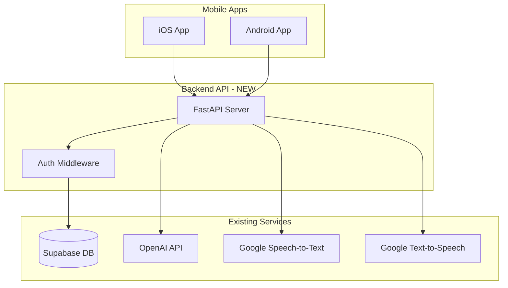

# 📱 Mobile App Launch Roadmap - AI Language Tutor

**Framework:** Flutter | **Timeline:** 6 months (July 2026) | **Status:** In Progress

---

## Executive Summary

Launching the AI Language Tutor as iOS and Android apps using **Flutter** with:
- **Voice conversation** via Google Cloud STT/TTS
- **AI tutoring** powered by OpenAI GPT-4o mini  
- **Social login** via Kakao, Naver, and Supabase
- **Payment integration** for premium features
- **French & English** language support

---

## Confirmed Decisions

> [!IMPORTANT]
> **Key Decision Points** that need your input:
> 1. **Framework Choice**: React Native vs Flutter vs Native (see comparison below)
> 2. **Timeline Preference**: MVP in 8-10 weeks vs polished app in 14-16 weeks
> 3. **Budget Considerations**: Developer costs + API fees + app store fees
> 4. **Audio Recording**: Native APIs vs WebView hybrid approach

---

## Approach Comparison

| Criteria | **React Native** | **Flutter** | **Native (Swift/Kotlin)** |
|----------|-----------------|-------------|--------------------------|
| Single Codebase | ✅ Yes | ✅ Yes | ❌ No (2 codebases) |
| Audio Recording | ✅ Good libraries | ✅ Good plugins | ✅ Best control |
| Performance | 🟡 Good | ✅ Excellent | ✅ Best |
| Learning Curve | 🟡 Medium (React/JS) | 🟡 Medium (Dart) | 🔴 High |
| Time to Market | ✅ 8-10 weeks | ✅ 8-10 weeks | 🔴 14-16 weeks |
| Python Backend Reuse | ✅ Full reuse | ✅ Full reuse | ✅ Full reuse |

### ✅ Recommendation: **React Native** or **Flutter**

Both allow a single codebase for iOS & Android while fully reusing your existing Python backend.

---

## Proposed Architecture



---

## Phase Breakdown

### Phase 1: Backend API Development (Weeks 1-3)

> [!NOTE]
> The current Streamlit app handles everything client-side. Mobile apps need a proper REST API.

| Task | Files to Create | Effort |
|------|-----------------|--------|
| Create FastAPI server | `backend/main.py` | 2 days |
| Auth endpoints | `backend/auth.py` | 2 days |
| Conversation endpoint | `backend/conversation.py` | 3 days |
| Audio processing endpoints | `backend/audio.py` | 3 days |
| WebSocket for real-time | `backend/ws.py` | 2 days |

**API Endpoints Needed:**

```
POST /api/auth/login
POST /api/auth/register
POST /api/conversation/send
POST /api/audio/transcribe
POST /api/audio/synthesize
WS   /api/conversation/stream
```

---

### Phase 2: Mobile App Development (Weeks 4-8)

#### Core Features (MVP)

| Feature | Description | Priority |
|---------|-------------|----------|
| User Authentication | Login/Register with Supabase | P0 |
| Voice Recording | Hold-to-talk or toggle recording | P0 |
| Audio Playback | Auto-play AI responses | P0 |
| Chat Interface | Text transcript of conversation | P0 |
| Settings | Language level, topic, persona | P1 |
| Corrections Display | Grammar tips in expandable cards | P1 |

#### Mobile-Specific Considerations

> [!WARNING]
> **Audio Recording** requires careful handling:
> - iOS: Request microphone permission via `Info.plist`
> - Android: Request `RECORD_AUDIO` permission at runtime
> - Both: Handle audio interruptions (calls, notifications)

---

### Phase 3: Testing & Optimization (Weeks 9-10)

| Test Type | Scope | Tools |
|-----------|-------|-------|
| Unit Tests | API endpoints | pytest |
| Integration Tests | Mobile ↔ Backend | Detox/Maestro |
| Audio Quality | Recording clarity | Manual testing |
| Performance | Response latency | Firebase Performance |

**Success Criteria from PRD:**
- Speech recognition accuracy > 85%
- Response latency < 3 seconds
- API availability > 99%

---

### Phase 4: App Store Submission (Weeks 11-12)

| Platform | Requirements | Timeline |
|----------|--------------|----------|
| **iOS** | Apple Developer Account ($99/yr), App Store assets, Privacy policy | 1-2 weeks review |
| **Android** | Google Play Console ($25 one-time), Store listing, Privacy policy | 2-3 days review |

**App Store Requirements:**
- [ ] App icons (multiple sizes)
- [ ] Screenshots for all device sizes
- [ ] Privacy policy URL
- [ ] App description & keywords
- [ ] Age rating questionnaire

---

## Recommended File Structure

```
01_conversational_speaking_ai/
├── app.py                    # Existing Streamlit app
├── backend/                  # NEW: FastAPI backend
│   ├── main.py
│   ├── auth.py
│   ├── conversation.py
│   ├── audio.py
│   └── requirements.txt
└── mobile/                   # NEW: React Native / Flutter app
    ├── src/
    │   ├── screens/
    │   ├── components/
    │   ├── services/
    │   └── utils/
    ├── ios/
    ├── android/
    └── package.json
```

---

## Cost Estimates

| Item | One-Time | Annual |
|------|----------|--------|
| Apple Developer Account | - | $99 |
| Google Play Console | $25 | - |
| Backend Hosting (Railway/Fly.io) | - | ~$120-240 |
| API Costs (existing) | - | Variable |

---

## Quick Start Options

### Option A: Fastest to Market (8 weeks)
Use **Expo (React Native)** with managed workflow:
- Pre-built audio recording components
- Simplified builds and deployment
- Some limitations on native features

### Option B: Most Flexibility (10-12 weeks)
Use **React Native CLI** or **Flutter**:
- Full native module access
- Better audio quality control
- More complex build setup

### Option C: Keep Web Only (2-3 weeks)
Create a **Progressive Web App (PWA)**:
- Works on mobile browsers
- "Add to Home Screen" functionality
- Limited audio recording support on iOS

---

## Next Steps After Approval

1. **Choose framework** (React Native / Flutter / PWA)
2. **Set up backend API** with FastAPI
3. **Create mobile project** with chosen framework
4. **Implement core features** incrementally
5. **Test on real devices** (iPhone + Android phone)
6. **Submit to app stores**

